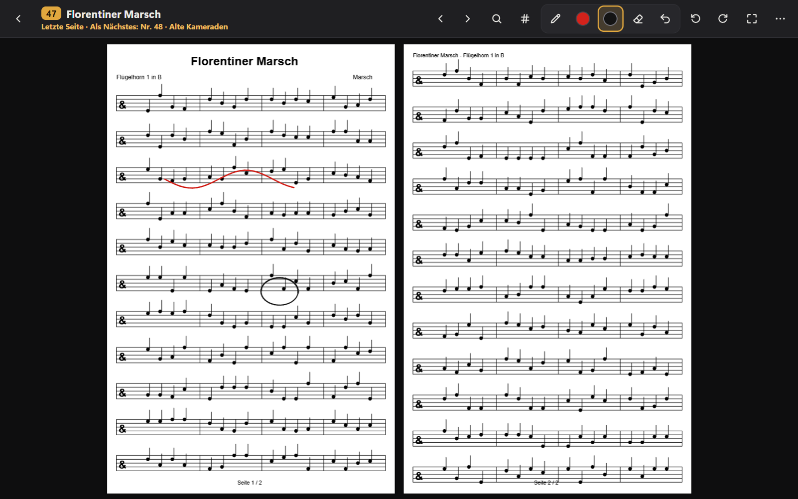
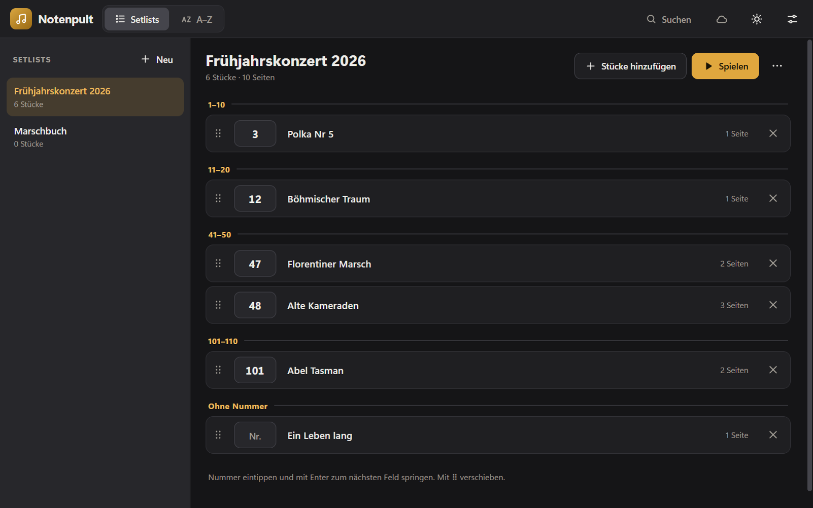
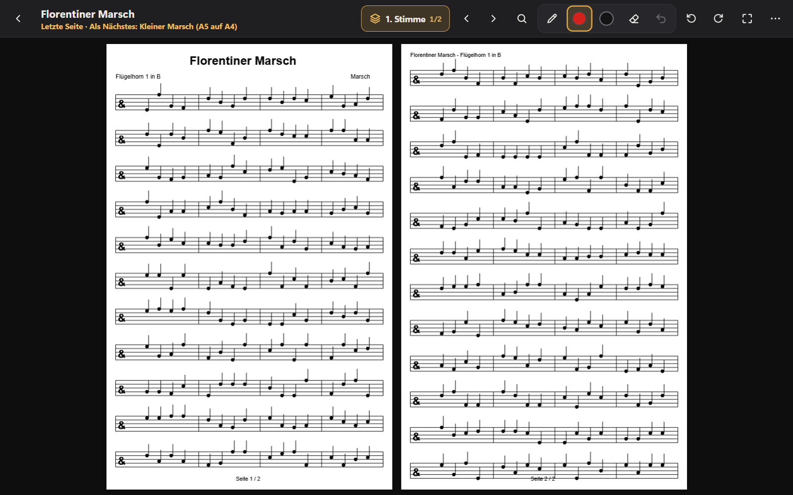
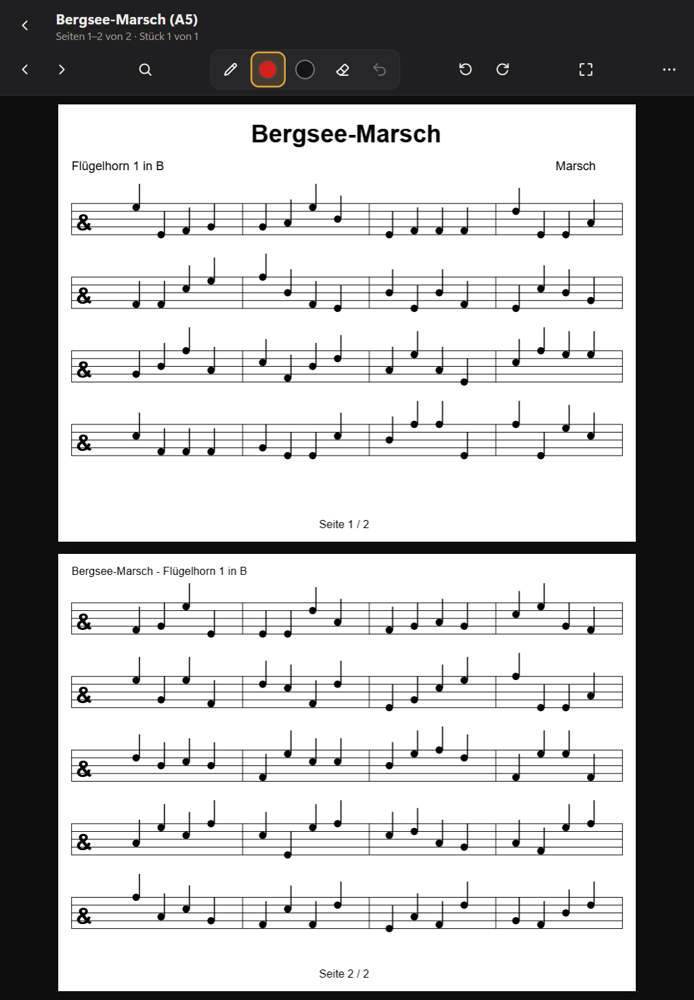
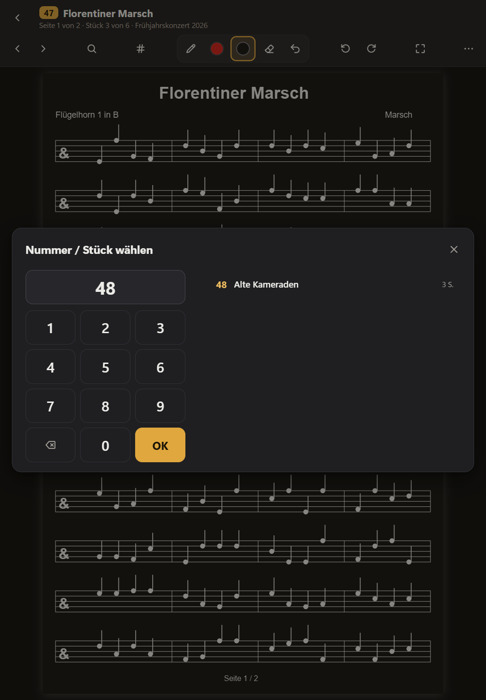
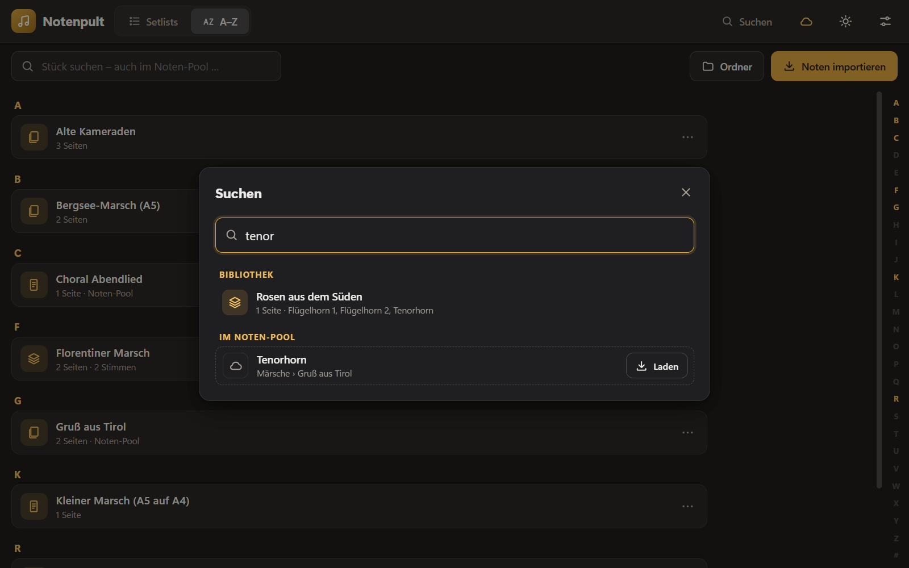
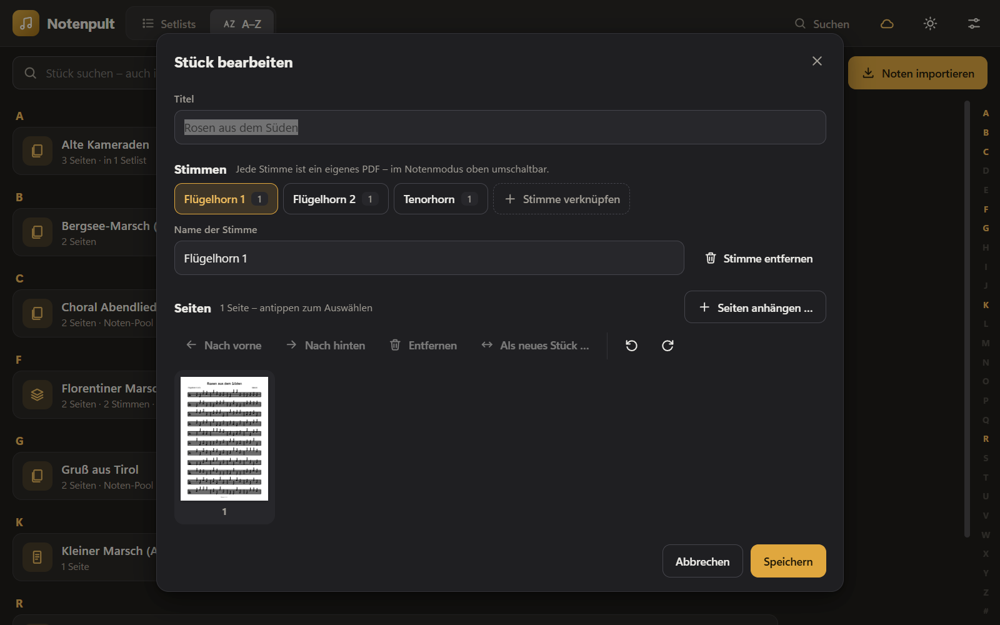
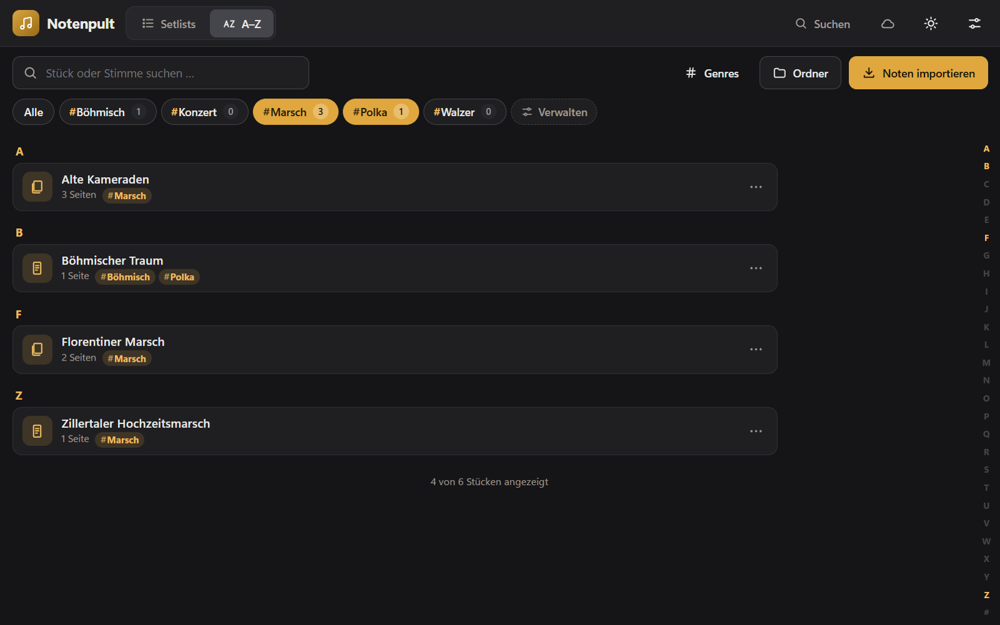
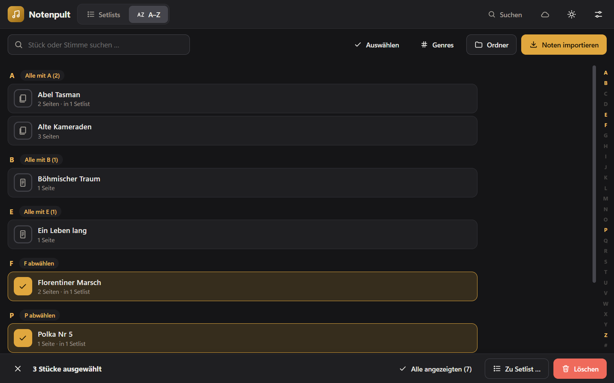

# Notenpult

Noten-App für Windows 11 und Android-Tablets für Blaskapelle und Brassband: Setlists mit Ordner-Nummern, A–Z-Bibliothek,
Blättern mit einem Tipp, mehrere Stimmen pro Stück, Stift-Anmerkungen in Rot und Schwarz,
A4/A5-Unterstützung, Dunkelmodus und ein Noten-Pool aus Google Drive, der auch offline funktioniert.



## Funktionen

- **Setlists**: beliebig viele, eigene Reihenfolge per Ziehen, Nummern aus dem Notenordner (z. B. 1–120 bei
  60 Stücken), Anzeige in Zehnerblöcken, „Nach Nummer sortieren“, „Nummern fortlaufend vergeben“.
- **A–Z-Bibliothek**: alphabetisch gruppiert, Buchstabenleiste zum Springen, Suche. Mehrfachauswahl über das
  Symbol vorne an jedem Stück – z. B. 100 Stücke auswählen und mit einem Tipp löschen oder in eine Setlist legen.
- **Genres**: eigene Hashtags wie `#Marsch`, `#Polka`, `#Kirche` – mehrere pro Stück, als Filter-Chips in der
  Bibliothek und beim Zusammenstellen von Setlists; `#polka` in jeder Suche.
- **Blättern**: Tippen oder Klicken irgendwo auf der Seite blättert weiter, am Stückende direkt ins nächste
  Stück. Zurück per Wischen nach rechts, Rechtsklick, ◀ oder Pfeiltaste. Fußpedale (Bild ↑/↓) funktionieren.
- **Nummer eingeben**: Im Notenmodus einfach die Nummer tippen, schon springt die App zum Stück.
- **Stimmen**: beliebig viele PDFs pro Stück (1., 2., 3. Stimme …), oben per Knopf umschaltbar.
  `Stück - 2. Stimme.pdf` wird beim Import automatisch verknüpft.
- **Stift**: Der Stift schreibt sofort, Finger und Trackpad blättern. Radieren mit dem Radierer-Ende oder der
  Stifttaste. Handballen-Erkennung, Rückgängig. Anmerkungen gelten je Stimme und Seite.
- **A4 / A5**: Die Ansicht „Automatisch“ füllt den Bildschirm: A4 im Querformat zwei Seiten nebeneinander,
  A5-Querformat im Hochformat zwei Seiten untereinander. Weiße Ränder werden automatisch abgeschnitten.
- **Zwei-Seiten-Ansicht**: „Zwei Seiten“ zeigt immer zwei Seiten zusammen; „Nur 2-seitige“ zeigt Stücke mit genau
  zwei Seiten komplett auf einem Bildschirm (ohne Umblättern), alle anderen einseitig. Je für Quer- und Hochformat.
- **Drehen**: ⟲ ⟳ dreht Seiten um 90°, die Drehung wird gespeichert.
- **Google Drive / Noten-Pool**: Ein Drive-Ordner wird zum Pool, auf Wunsch gefiltert auf die eigene Stimme.
  Noten werden kopiert und sind offline verfügbar; Änderungen kommen bei Verbindung automatisch.
- **Suche**: über Titel, Stimmen, Setlist-Nummern und den Noten-Pool. Während des Spielens wird ein
  gefundenes Stück eingeschoben (z. B. für Zugaben).
- **Darstellung**: Hell/Dunkel, Noten optional invertiert, Hoch- und Querformat, Vollbild, Bildschirm bleibt an.

| Setlist mit Nummern | Stimmen umschalten | A5 im Hochformat |
| --- | --- | --- |
|  |  |  |

| Nummernblock | Suche im Noten-Pool | Stück bearbeiten |
| --- | --- | --- |
|  |  |  |



## Mehrere Stücke auf einmal (A–Z)



- **Starten**: vorne auf das Symbol eines Stücks tippen (oder oben „Auswählen“). Jetzt wählt jeder Tipp auf eine
  Zeile aus bzw. ab – geöffnet wird nichts.
- **Viele auf einmal**: Umschalt+Klick wählt alles zwischen zwei Stücken, „Alle mit A“ neben dem Buchstaben eine
  ganze Gruppe, „Alle angezeigten“ in der Leiste alles, was Suche und Genre-Chips gerade zeigen
  (z. B. `#polka` suchen → alle Polkas).
- **Aktionen** in der Leiste unten: „Zu Setlist …“ oder „Löschen“. Vor dem Löschen fragt Notenpult nach und nennt
  Anzahl, Titel und betroffene Setlists. Mit den Stücken gehen ihre Setlist-Einträge und Anmerkungen; der Noten-Pool
  lädt gelöschte Stücke nicht erneut.
- **Beenden**: ✕ in der Leiste, Esc, Zurück-Taste (Android) oder Wechsel zu den Setlists.

## Genres

- **Anlegen**: A–Z → „Genres“ (oder „Verwalten“ in der Chip-Leiste). Eigene Namen, `#` davor ist egal;
  Vorschläge wie Marsch, Polka, Walzer lassen sich antippen.
- **Zuordnen**: im Menü eines Stücks „Genres …“, im Stück-Editor, oder unter „Genres“ → „Stücke zuordnen“ alle
  passenden Stücke auf einmal anhaken.
- **Suchen**: Chips über der A–Z-Liste antippen (mehrere = „oder“), `#polka` ins Suchfeld tippen, oder in der
  globalen Suche (Strg+F) auf ein Genre tippen. Beim Zusammenstellen einer Setlist filtern die Chips ebenfalls –
  „Alle angezeigten wählen“ nimmt z. B. alle Märsche auf einmal.
- **Umbenennen** auf einen vorhandenen Namen führt beide Genres zusammen; Löschen entfernt nur das Genre,
  nicht die Stücke.

## Installation & Updates

Fertige Builds gibt es unter **Releases** (`Notenpult-win32-x64.zip`): entpacken und `Notenpult.exe`
starten. Selbst bauen: siehe [Entwicklung](#entwicklung).

**Updates** kommen danach direkt in der App: *Einstellungen → Updates → „Nach Updates suchen“*, dann
*„Jetzt aktualisieren“*. Notenpult lädt die neue Version, prüft sie (SHA-256), tauscht die Programmdateien und
startet neu. Meist wird nur der App-Teil geladen (wenige MB), das komplette Paket nur bei einer neuen
Electron-Laufzeit. Noten, Setlists, Stimmen und Anmerkungen in `Dokumente\Notenpult` bleiben unberührt.
Auf Wunsch sucht die App beim Start selbst und zeigt einen roten Punkt am Einstellungen-Knopf.
Nach dem Neustart bestätigt Notenpult die neue Version – oder sagt, warum das Update nicht eingespielt wurde.

Liegt Notenpult in einem geschützten Ordner (z. B. `C:\Programme`), fragt Windows beim Aktualisieren nach
Administratorrechten – dort „Ja“ wählen. Ohne diese Abfrage geht es, wenn der Ordner dem eigenen Benutzer gehört.

**Empfohlener Ort:** `%LOCALAPPDATA%\Programs\Notenpult` (in die Adresszeile des Explorers eingeben). Nicht in
„Dokumente“, auf dem Desktop oder in OneDrive: Dort synchronisiert OneDrive unnötig ~250 MB Programmdateien, und der
Ransomware-Schutz von Windows kann Updates blockieren. Umziehen: Notenpult schließen, den ganzen Ordner
verschieben, Verknüpfung neu anlegen – die Noten in `Dokumente\Notenpult` bleiben, wo sie sind.

## Android-Tablet

Die Android-App hat dieselbe Oberfläche und läuft ab **Android 5.0** – gedacht z. B. für das Galaxy Tab S2.

**Installieren**

1. Auf dem Tablet unter *Einstellungen → Sicherheit* (bzw. *Gerätesicherheit*) **„Unbekannte Quellen“** erlauben.
2. Im Browser des Tablets die neueste Version unter
   [Releases](https://github.com/MaxKuhnDE/notenpult/releases/latest) öffnen und `Notenpult-android.apk`
   laden – oder die Datei am PC laden und per USB in den Ordner „Download“ kopieren.
3. Die Datei antippen → **Installieren**.
4. Zeigt Notenpult „Android System WebView ist zu alt“: im Play Store *Android System WebView* aktualisieren
   (unter Android 5 gibt es dort Version 95, gebraucht wird mindestens 92).

Zeigt der Browser des Tablets GitHub als **„unsichere Seite“**, liegt das an Android 5: Es kennt die heutigen
Stammzertifikate von GitHub nicht. Dann die APK am PC laden und per USB kopieren. Notenpult selbst bringt ab
1.3.1 aktuelle Zertifikate mit – die Update-Suche in der App funktioniert also trotzdem.

**Alles vom PC übernehmen**

1. Am PC: *Einstellungen → Daten → „Exportieren …“* – speichert z. B. `Notenpult-Export-2026-10-02.zip`.
2. Tablet per USB anschließen und die ZIP in den Ordner **„Download“** kopieren.
3. Auf dem Tablet: *„Export vom PC importieren“* (bzw. *Einstellungen → Daten → „Importieren …“*) und die ZIP
   wählen. Danach sind Stücke, Stimmen, Setlists mit Nummern, Genres, Anmerkungen und Einstellungen
   **spiegelgleich** zum PC.

Später geht es jederzeit wieder so – auch umgekehrt (Tablet exportieren, am PC importieren), z. B. um
Anmerkungen vom Tablet zurückzuholen. Der Import ersetzt immer alles auf dem Zielgerät.

**Bedienung**: Tippen blättert wie am PC. Das Galaxy Tab S2 hat keinen Stift – zum Schreiben oben den
**Zeichenmodus** (Stift-Symbol) einschalten, dann schreibt der Finger; Radierer und Rückgängig wie gewohnt.
Die Zurück-Taste schließt Dialoge und die Notenansicht. Updates: *Einstellungen → Updates → „Jetzt
aktualisieren“* lädt die neue APK und öffnet die Installation – dort „Installieren“ tippen, die Daten bleiben
erhalten.
Google Drive (Noten-Pool) gibt es nur unter Windows; die Noten kommen über den Export aufs Tablet.

## Bedienung im Notenmodus

| Aktion | Wirkung |
| --- | --- |
| Tippen / Klicken irgendwo (Finger, Trackpad, Maus) | nächste Seite, am Stückende nächstes Stück |
| Nach rechts wischen, Rechtsklick, ←, Bild ↑ | zurück |
| →, Bild ↓, Leertaste, Fußpedal | weiter |
| Stift | schreibt sofort (Farbe oben wählen) |
| Radierer-Ende oder Stifttaste | löscht ganze Striche |
| Ziffern tippen oder `#` | zu Nr. springen (Setlists) |
| Stimmen-Knopf oben / Taste `S` | nächste Stimme |
| ⟲ ⟳ | Seite um 90° drehen |
| Lupe / Strg+F | Suche, auch im Noten-Pool |
| F11 / Esc | Vollbild / zurück zur Übersicht |

## Google Drive (Noten-Pool)

Voraussetzung ist [Google Drive für Desktop](https://www.google.com/drive/download/) (Laufwerk mit „Meine Ablage“).
Über den Wolken-Knopf oben einen Drive-Ordner wählen:

- **Nur meine Stimme**: Filter wie `Flügelhorn 1` (mehrere mit Komma).
- **Aufbau**: „Jede Datei = ein Stück“ oder „Unterordner = Stück“
  (`Rosen aus dem Süden/Flügelhorn 1.pdf`, `…/Flügelhorn 2.pdf` → ein Stück mit zwei Stimmen).
- **Übernehmen**: „Alles automatisch“ (Abgleich beim Start, alle 10 Minuten und wenn die Verbindung
  zurückkommt) oder „Nur bei Bedarf“ (einzelne Stücke über die Suche laden).

Geladene Noten sind Kopien in Notenpult. In Drive gelöschte Dateien bleiben erhalten, geänderte werden
übernommen (Anmerkungen bleiben).

## Daten & Sicherung

Alles liegt in `Dokumente\Notenpult`:

| Datei/Ordner | Inhalt |
| --- | --- |
| `notenpult.json` | Stücke, Stimmen, Setlists, Einstellungen |
| `notenpult.backup.json` | Stand vom letzten Start |
| `Noten\` | importierte PDFs/Bilder (Kopien – Originale bleiben unberührt) |
| `Anmerkungen\` | Stiftstriche je Stück |
| `pool-index.json` | zuletzt gelesener Inhalt des Noten-Pools (Suche offline) |
| `_vor-import\` | Stand vor dem letzten „Alles importieren“ |

### Alles übertragen (z. B. PC → Tablet) oder sichern

*Einstellungen → Daten → „Exportieren …“* erstellt **eine ZIP-Datei** mit allen Stücken (PDFs/Bilder), Stimmen,
Setlists, Genres, Anmerkungen und Einstellungen. Auf dem anderen Gerät *„Importieren …“* wählen und die ZIP
öffnen: Danach ist dort alles **spiegelgleich** – vorher Vorhandenes wird ersetzt (unter Windows bleibt es in
`_vor-import` erhalten). Das funktioniert in beide Richtungen, also auch, um Anmerkungen vom Tablet zurück auf
den PC zu holen.

## Entwicklung

Voraussetzungen: Windows, [Node.js](https://nodejs.org/) 22.12 oder neuer.

```bash
npm install
```

```bash
npm start
```

```bash
npm test
```

```bash
npm run package
```

- `npm install` lädt auch die Electron-Laufzeit und kopiert pdf.js nach `renderer/vendor/`.
- `npm test` startet die App unsichtbar mit Beispielnoten und prüft Blättern, Stift, Stimmen, A4/A5,
  Drehen, Noten-Pool, Suche usw. (Screenshots landen in `test/out/`).
- `npm run package` baut `dist/Notenpult-win32-x64/Notenpult.exe`.
- Android: `npm run android:web` bündelt die Oberfläche nach `android/app/src/main/assets/www`, danach baut
  `gradle -p android assembleDebug` (Android SDK, JDK 17, Gradle 8.11) die APK. Die CI macht beides.

Aufbau des Codes: [docs/ARCHITEKTUR.md](docs/ARCHITEKTUR.md) · Arbeitsweise mit Branches und Pull Requests:
[CONTRIBUTING.md](CONTRIBUTING.md) · Änderungen: [CHANGELOG.md](CHANGELOG.md)

## Technik

[Electron](https://www.electronjs.org/) und [pdf.js](https://mozilla.github.io/pdf.js/) (Apache-2.0) mit
reinem JavaScript (ES-Module) und CSS, ohne Framework und ohne Build-Schritt für die Oberfläche.
Die Android-App ist eine schlanke Java-Activity mit WebView; dieselbe Oberfläche wird dafür mit
[esbuild](https://esbuild.github.io/) für Chrome 92–95 gebündelt und nutzt pdf.js 3.11.
